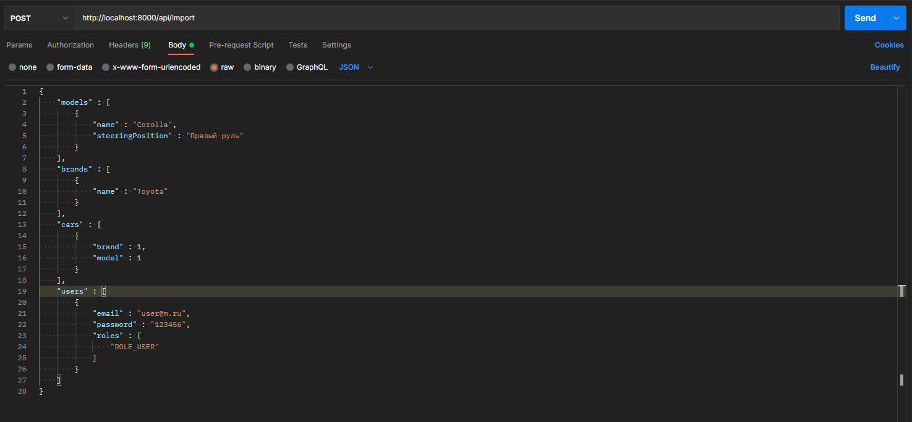

# cars-catalog
 Cars catalog

Маршруты:
- "/" - Домашняя страница
- "/car" - Каталог автомобилей
- "/model" - Каталог моделей автомобилей
- "/brand" - Каталог марок автомобилей
- "/admin" - Каталог пользователей
- "/login" - Вход в аккаунт
- "/register" - Регистрация аккаунта
- "/logout" - Выход из аккаунта
- "/api/import" - Api импорта данных

Основные страницы:
- Домашняя страница - Содержит кнопки для перехода на страницы каталогов автомобилей, моделей и марок.
- Каталог автомобилей - Содержит CRUD
- Каталог моделей автомобилей - Содержит CRUD
- Каталог марок автомобилей - Содержит CRUD
- Каталог пользователей (admin only) - Содержит CRUD

Алгоритм импортирования данных:
В папке "var" находится файл data_import.json с примером данных для импорта.
По маршруту /api/import необходимо послать post запрос с body содержащим json из представленного файла.
Например это можно сделать через Postman. 

Список ролей пользователей:
- ROLE_USER,
- ROLE_MANAGER,
- ROLE_ADMIN

Права пользователей в зависимости от роли:
- ROLE_USER - Просмотр каталогов автомобилей, моделей автомобилей и марок автомобилей
- ROLE_MANAGER - Просмотр и редактирование каталогов автомобилей, моделей автомобилей и марок автомобилей
- ROLE_ADMIN - Полные CRUD права для каталогов автомобилей, моделей автомобилей, марок автомобилей и пользователей
P.S Импорт данных доступен всем пользователям, не зависимо от ролей

В проекте используется sqlite. Для корректной работы необходимо в файле php.ini раскомментировать ;extension отвечающие за sqlite.
